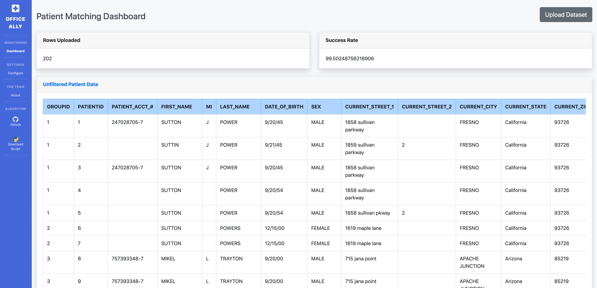

# Patient-Matching
LAHacks Patient Matching Challenge

<h1 align="center"><a href="https://allymatch.herokuapp.com/">AllyMatch Online Patient Matching Dashboard</a></h1>

<p align="center">

</p>

## Explanation

We initially intended to take an ML approach to solving the problem, but as we started exploring the dataset we realized that an approach using a combination of soundex values and a weighted levenshtein distance could give us near perfect results.

We went through each column type and manually ranked values that would likely be misheard in a hospital setting.  We then created a heuristic technique to match patients to each other based on the algorithm defined below.  We were able to achieve ~~99.5%~~ high accuracy on the given dataset (after changing some weights we are now unclear about the success rate, but it's consistently >90%)

We are using these weights:

```
{
    "PATIENT_ACCT_#": 1.00,
	"First": .930,
    "CURRENT_ZIP_CODE": .555,
    "CURRENT_STATE": .511,
    "CURRENT_STREET_1": .509,
    "DATE_OF_BIRTH": .503,
    "LAST_NAME": .491,
    "FIRST_NAME": .400,
    "MI": .310,
    "CURRENT_CITY": .303,
    "SEX": .100,
    "CURRENT_STREET_2": .100,
    "PREVIOUS_FIRST_NAME": .100,
    "PREVIOUS_MI": .100,
    "PREVIOUS_LAST_NAME": .100,
    "PREVIOUS_STREET_1": .100,
    "PREVIOUS_STREET_2": .100,
    "PREVIOUS_CITY": .100,
    "PREVIOUS_STATE": .100,
    "PREVIOUS_ZIP_CODE": .100,
}

```

and this psuedocode to compare rows:

```
Go over every row in the dataset and remove null values
calculate soundex score for the name of each patient

# This example is comparing row1 to row2

iterate over each column value each row
split each value on a space character and calculate the sum of levenshtein distances for each piece
divide the sum of levenshtein distances by the length of the word -> set as distanceScore

if distanceScore is within a certain threshold add the column weight to a combined score value
# our program has a default threshold of 0.2 

the relationship between the rows is now defined numerically
the highest value score is the most similar row
```

## How to test

```python calc_accuracy.py {csvfile.csv}```
